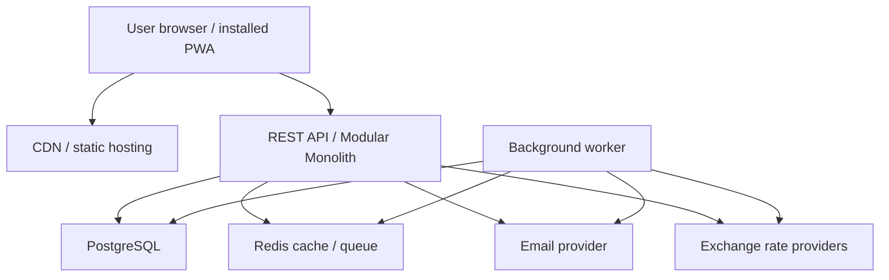
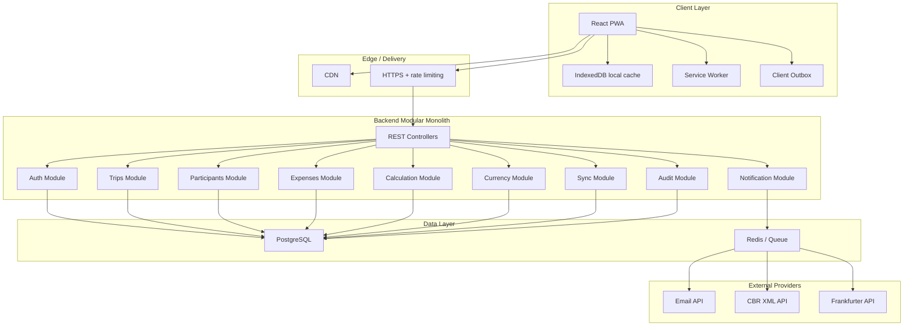
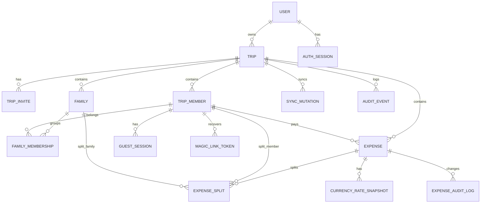
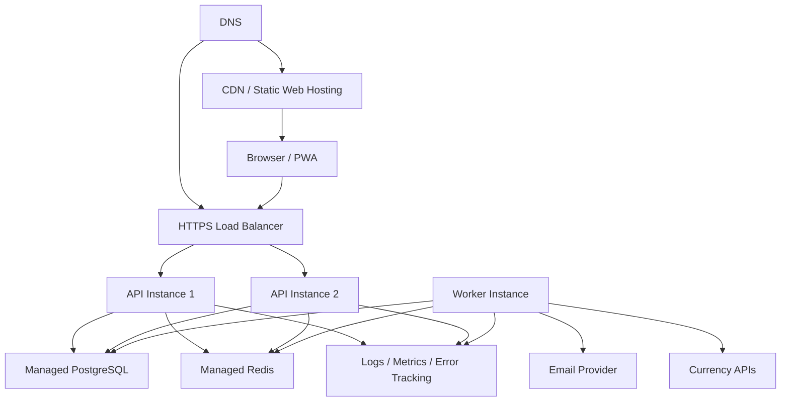

# System Architecture: Owebee

- **Document Version:** 0.1
- **Date:** 2026-06-30
- **Author:** Codex BMAD Architect
- **Status:** Draft

---

## Table of Contents

1. [System Overview](#1-system-overview)
2. [Architecture Pattern](#2-architecture-pattern)
3. [Component Design](#3-component-design)
4. [Data Model](#4-data-model)
5. [API Specifications](#5-api-specifications)
6. [Non-Functional Requirements Mapping](#6-non-functional-requirements-mapping)
7. [Technology Stack](#7-technology-stack)
8. [Trade-off Analysis](#8-trade-off-analysis)
9. [Deployment Architecture](#9-deployment-architecture)
10. [Future Considerations](#10-future-considerations)
11. [Appendix](#appendix)

---

## 1. System Overview

### Purpose

Owebee - web/PWA-приложение для учета совместных расходов в поездках. Система должна позволять зарегистрированному пользователю создать поездку, пригласить участников по ссылке, принимать гостевых пользователей по имени и email, вести расходы, рассчитывать персональные и семейные доли, пересчитывать расходы в разных валютах и показывать баланс каждого участника или семьи.

### Scope

**In Scope:**
- Регистрация и вход owner.
- Создание, редактирование, архивирование и удаление поездки.
- Invite link и guest join flow.
- Восстановление guest access через email magic link.
- Участники, семьи и персональные доли.
- Расходы, права редактирования и история изменений.
- Валютный каталог, exchange-rate lookup, snapshot курса и manual rate.
- Балансы участников и семей без обязательной минимизации переводов.
- Responsive PWA на русском и английском.
- Offline read cache, offline expense creation, sync queue и conflict state.
- Наблюдаемость, аудит критичных действий и базовая privacy/security модель.

**Out of Scope:**
- Встроенные платежи и переводы денег.
- OCR чеков.
- Push-уведомления.
- B2B/корпоративные сценарии.
- Минимизация переводов как обязательный settlement graph.
- Полная collaborative offline editing модель на CRDT.

### Architectural Drivers

1. **FR-018 / NFR-006: Offline sync** - архитектура должна иметь client-side storage, outbox, idempotency keys, version checks и conflict states.
2. **FR-011 / NFR-009: Расчет семейных долей** - доменная логика расчетов должна быть изолирована и покрыта unit tests.
3. **FR-012 / FR-013: Валютные snapshots** - финансовые значения должны хранить исходную сумму, исходную валюту, курс, источник и converted amount, чтобы старые расходы не менялись от рыночных колебаний.
4. **FR-003: Редактируемая базовая валюта** - модель должна отделять canonical expense data от отображаемого баланса в текущей base currency.
5. **FR-005 / FR-006 / NFR-004: Guest access and magic links** - система должна безопасно разделять invite token, participant session и recovery token.
6. **NFR-001 / NFR-002: Производительность** - список расходов и баланс должны быстро открываться и пересчитываться для 20 участников и 300 расходов.
7. **FR-019 / NFR-007: RU/EN and responsive** - frontend должен иметь i18n, adaptive layouts и PWA installability.
8. **MVP free service constraint** - инфраструктура должна оставаться простой и недорогой.

### Stakeholders

- **Users:** Компании друзей, owner поездки, гостевые участники, семьи в поездке.
- **Developers:** Небольшая product engineering команда; архитектура должна быть понятной для 1-5 разработчиков.
- **Operations:** Минимальная DevOps-нагрузка, managed services, CI/CD и observability по умолчанию.
- **Business:** Бесплатный публичный MVP с возможностью роста в freemium later.

---

## 2. Architecture Pattern

### Selected Pattern

**Pattern:** Modular Monolith + REST API + Local-first PWA sync layer.

### Pattern Justification

**Why this pattern:**
- PRD описывает multi-epic продукт среднего уровня сложности, но без масштаба и команды, которые оправдали бы microservices.
- Расчет расходов, валют и offline sync требует строгих доменных границ, но не требует независимого деплоя сервисов.
- Modular monolith упрощает транзакционную консистентность для финансовых расчетов и прав доступа.
- REST API проще для PWA, sync endpoints и будущих mobile clients.
- Отдельные background workers нужны для email и currency-rate jobs, но они могут жить в той же кодовой базе и использовать общую доменную модель.

**Alternatives considered:**
- **Simple Monolith:** отклонен, потому что риск смешать auth, trips, expenses, currency, sync и calculations слишком высок.
- **Microservices:** отклонен для MVP из-за лишней операционной сложности, распределенных транзакций и роста стоимости.
- **GraphQL-first API:** отклонен для MVP из-за усложнения caching, auth rules и offline mutation semantics.
- **Full Event Sourcing:** отклонен для MVP как чрезмерный; audit log и sync mutation log покрывают нужные сценарии проще.

### Pattern Application

Система строится как единый backend deployment с модульной структурой:

- `auth` - registered users, sessions, guest sessions, magic links.
- `trips` - trips, invites, archive/delete, base currency.
- `participants` - members, families, personal shares, roles.
- `expenses` - expenses, splits, permissions, audit log.
- `calculations` - balances, family aggregation, currency conversion use cases.
- `currency` - currency catalog, provider adapters, rate snapshots.
- `sync` - outbox ingestion, idempotency, version conflict detection.
- `notifications` - email delivery.
- `observability` - logs, metrics, audit events.

Frontend - отдельное PWA-приложение в той же монорепе, работающее с REST API. Offline changes хранятся в IndexedDB и отправляются через sync endpoint при восстановлении сети.

### High-Level Context



---

## 3. Component Design

### Component Overview



### Component: React PWA Client

**Responsibility:** Предоставляет responsive RU/EN интерфейс, PWA installability, offline cache и client outbox.

**Interfaces Provided:**
- Browser UI для trip, expenses, balance, settings.
- Service worker fetch/cache handling.
- IndexedDB repositories for cached trips, expenses, balances and pending mutations.

**Interfaces Required:**
- REST API.
- Browser APIs: IndexedDB, Service Worker, Cache Storage, navigator online/offline events.

**Data Owned:**
- Локальные cached snapshots.
- Pending mutations.
- Client device id.
- UI language preference.

**Key Operations:**
1. Render trip workspace on mobile and desktop.
2. Store last synced trip state for offline viewing.
3. Create offline expense mutation in client outbox.
4. Replay pending mutations when online.
5. Display sync states: `pending`, `syncing`, `synced`, `conflict`, `failed`.

**NFRs Addressed:**
- NFR-001: browser caching and local read cache.
- NFR-006: local durability of offline changes.
- NFR-007: responsive layouts and WCAG-oriented UI.
- FR-019: i18n resource bundles for Russian and English.

### Component: API Layer

**Responsibility:** Exposes versioned REST endpoints, performs request validation, authentication, authorization and response shaping.

**Interfaces Provided:**
- `/api/v1/auth/*`
- `/api/v1/trips/*`
- `/api/v1/participants/*`
- `/api/v1/expenses/*`
- `/api/v1/balances/*`
- `/api/v1/currencies/*`
- `/api/v1/sync/*`

**Interfaces Required:**
- Auth Module for identity and session resolution.
- Domain modules for use cases.
- Observability middleware.

**Data Owned:**
- No domain data; owns DTO schemas and API contracts.

**Key Operations:**
1. Validate input using schema validation.
2. Attach `request_id`, actor and trip context.
3. Enforce coarse auth before calling domain services.
4. Return localized error codes/messages.

**NFRs Addressed:**
- NFR-003: server-side authorization.
- NFR-001: pagination and compact DTOs.
- Security: input validation and rate limiting hooks.

### Component: Auth Module

**Responsibility:** Manages registered users, guest participant sessions, magic links and token lifecycle.

**Interfaces Provided:**
- Register user.
- Login user.
- Create guest participant session.
- Request magic link.
- Verify magic link.
- Resolve current actor.

**Interfaces Required:**
- Notification Module for email.
- Trips/Participants Module to validate trip membership.
- Audit Module for auth events.

**Data Owned:**
- `users`
- `auth_sessions`
- `guest_sessions`
- `magic_link_tokens`
- `password_credentials` if password auth is selected.

**Key Operations:**
1. Create registered owner account.
2. Issue secure session token.
3. Create guest session bound to trip participant.
4. Send and verify magic link.
5. Rotate or expire tokens.

**NFRs Addressed:**
- NFR-003: authenticated actor resolution.
- NFR-004: magic link security.
- Compliance: email data minimization and audit trail.

### Component: Trips Module

**Responsibility:** Owns trip lifecycle, invite links, base currency and owner-level settings.

**Interfaces Provided:**
- Create trip.
- Update trip settings.
- Rotate invite token.
- Archive trip.
- Delete trip with confirmation.

**Interfaces Required:**
- Auth Module for owner identity.
- Currency Module for base currency validation.
- Audit Module for setting changes.

**Data Owned:**
- `trips`
- `trip_invites`
- `trip_settings_history`

**Key Operations:**
1. Create trip for registered user.
2. Generate invite token.
3. Change base currency with audit event.
4. Archive/unarchive trip.
5. Soft delete or hard delete per retention policy.

**NFRs Addressed:**
- NFR-003: owner-only operations.
- NFR-006: trip version changes for sync.

### Component: Participants Module

**Responsibility:** Manages trip members, roles, families and personal share weights.

**Interfaces Provided:**
- Join trip as guest.
- Add/update/archive participant.
- Add/update/archive family group.
- Resolve calculation units for a trip.

**Interfaces Required:**
- Auth Module for actor.
- Trips Module for trip existence and access.
- Audit Module for membership changes.

**Data Owned:**
- `trip_members`
- `families`
- `family_membership`

**Key Operations:**
1. Create guest participant on invite.
2. Store role: `owner`, `participant`.
3. Maintain `share_count` for standalone users and families.
4. Produce calculation participants: personal units and display aggregates.

**NFRs Addressed:**
- FR-011: family aggregation and personal share model.
- NFR-009: isolated calculation-ready data.

### Component: Expenses Module

**Responsibility:** Owns expense creation, editing, split participants, permissions and audit history.

**Interfaces Provided:**
- Create expense.
- Update expense.
- List expenses.
- Get expense detail.
- Archive/delete expense if later required.

**Interfaces Required:**
- Auth Module for actor.
- Participants Module for split validation.
- Currency Module for rate snapshot.
- Calculation Module for balance invalidation/recalculation.
- Audit Module for changes.

**Data Owned:**
- `expenses`
- `expense_splits`
- `expense_audit_log`
- `idempotency_keys`

**Key Operations:**
1. Validate payer and split participants.
2. Store original amount without rounding.
3. Store converted amount and rate snapshot.
4. Enforce owner edits all, participant edits only own expenses.
5. Emit audit and calculation invalidation events.

**NFRs Addressed:**
- NFR-002: efficient calculation input.
- NFR-003: permission enforcement.
- NFR-009: testable domain logic.

### Component: Calculation Module

**Responsibility:** Computes balances for participants and families using expenses, splits, personal share units and current base currency display rules.

**Interfaces Provided:**
- Calculate trip balance.
- Explain balance breakdown.
- Recalculate after base currency change.

**Interfaces Required:**
- Expenses Module data.
- Participants Module calculation units.
- Currency Module for display conversion if needed after base currency change.

**Data Owned:**
- Optional `balance_snapshots` cache.
- No canonical financial input data; calculations derive from expenses and splits.

**Key Operations:**
1. Expand families into personal share units.
2. Allocate each expense by selected units.
3. Aggregate result back to display participants and families.
4. Compute net balance per display entity.
5. Generate breakdown per balance line.

**NFRs Addressed:**
- NFR-002: p95 calculation target.
- NFR-009: critical unit test target.

### Component: Currency Module

**Responsibility:** Provides currency catalog, rate provider abstraction, exchange-rate cache and expense-level snapshots.

**Interfaces Provided:**
- List/search currencies.
- Get rate for date/base/target.
- Create rate snapshot for expense.
- Mark manual rate.

**Interfaces Required:**
- External providers: CBR XML API, Frankfurter API or alternative provider.
- Redis/cache for provider results.
- Audit Module for manual rate changes.

**Data Owned:**
- `currencies`
- `exchange_rates_cache`
- `currency_rate_snapshots`

**Key Operations:**
1. Validate supported currency code.
2. Fetch rate by date from provider.
3. Cache provider response.
4. Store immutable snapshot on expense.
5. Support manual override.

**NFRs Addressed:**
- Reliability: graceful degradation to manual rate.
- FR-012: stable historical expenses.
- FR-014: broad currency catalog.

### Component: Sync Module

**Responsibility:** Accepts client mutations, applies idempotency, checks versions and returns sync results.

**Interfaces Provided:**
- Push pending mutations.
- Pull trip changes since cursor.
- Report mutation status.

**Interfaces Required:**
- Domain modules for applying commands.
- Audit Module for sync events.

**Data Owned:**
- `client_devices`
- `sync_mutations`
- `sync_cursors`
- `entity_versions`

**Key Operations:**
1. Register device id for actor/session.
2. Accept mutation with `client_mutation_id`.
3. Deduplicate mutation by actor/device/idempotency key.
4. Apply mutation if base entity version matches.
5. Return `applied`, `duplicate`, `conflict` or `rejected`.
6. Provide pull changes since last cursor.

**NFRs Addressed:**
- NFR-006: reliable offline sync.
- NFR-003: server-side authorization for replayed offline actions.
- Data integrity: no duplicate expenses on retry.

### Component: Notification Module

**Responsibility:** Sends transactional emails for magic links and service messages.

**Interfaces Provided:**
- Send magic link email.
- Send localized email template.

**Interfaces Required:**
- Email provider API.
- Queue/worker for retry.
- Auth Module for token metadata.

**Data Owned:**
- `email_delivery_log`
- Template identifiers and locale mapping.

**Key Operations:**
1. Queue magic link email.
2. Render RU/EN template.
3. Retry transient provider failures.
4. Log delivery status without storing secret token body.

**NFRs Addressed:**
- NFR-004: magic link flow reliability.
- Observability: delivery failure metrics.

### Component: Audit and Observability Module

**Responsibility:** Records security-sensitive actions, domain changes, structured logs, metrics and errors.

**Interfaces Provided:**
- Audit event writer.
- Structured logger.
- Metrics emitter.

**Interfaces Required:**
- Database for audit log.
- External monitoring/error tracking services.

**Data Owned:**
- `audit_events`
- Application logs and metrics.

**Key Operations:**
1. Log auth events, permission denials, trip settings changes and expense edits.
2. Attach correlation IDs.
3. Emit metrics for latency, sync failures, currency provider failures and email delivery.

**NFRs Addressed:**
- Security auditability.
- Maintainability and operational readiness.

---

## 4. Data Model

### Entity Relationship Diagram



### Entity Specifications

#### Entity: `users`

**Purpose:** Зарегистрированные пользователи, которые могут создавать поездки.

**Attributes:**
- `id` (UUID, PK)
- `email` (citext, unique)
- `display_name` (text)
- `locale` (varchar(5), default `ru`)
- `status` (enum: `active`, `disabled`)
- `created_at` (timestamp)
- `updated_at` (timestamp)

**Relationships:**
- Owns many `trips`.
- Has many `auth_sessions`.

**Indexes:**
- Unique index on `email`.

**Constraints:**
- Email normalized to lowercase.
- Locale in `ru`, `en`.

#### Entity: `auth_sessions`

**Purpose:** Registered user sessions.

**Attributes:**
- `id` (UUID, PK)
- `user_id` (UUID, FK)
- `session_hash` (text)
- `expires_at` (timestamp)
- `created_at` (timestamp)
- `revoked_at` (timestamp, nullable)

**Indexes:**
- Index on `user_id`.
- Unique index on `session_hash`.

**Constraints:**
- Store token hash, not raw token.

#### Entity: `trips`

**Purpose:** Workspace for shared expenses.

**Attributes:**
- `id` (UUID, PK)
- `owner_user_id` (UUID, FK users)
- `name` (text)
- `base_currency_code` (char(3), FK currencies)
- `status` (enum: `active`, `archived`, `deleted`)
- `version` (integer)
- `created_at` (timestamp)
- `updated_at` (timestamp)
- `archived_at` (timestamp, nullable)
- `deleted_at` (timestamp, nullable)

**Relationships:**
- Has many `trip_members`, `families`, `expenses`, `trip_invites`.

**Indexes:**
- Index on `owner_user_id, status`.
- Index on `updated_at`.

**Constraints:**
- Only registered users can own trips.
- `version` increments on settings changes.

#### Entity: `trip_invites`

**Purpose:** Invite token for joining a trip.

**Attributes:**
- `id` (UUID, PK)
- `trip_id` (UUID, FK)
- `token_hash` (text, unique)
- `status` (enum: `active`, `revoked`)
- `created_by_user_id` (UUID, FK users)
- `created_at` (timestamp)
- `revoked_at` (timestamp, nullable)

**Indexes:**
- Unique index on `token_hash`.
- Index on `trip_id, status`.

**Constraints:**
- Raw invite token never stored.

#### Entity: `trip_members`

**Purpose:** Display participant or accountable person inside a trip.

**Attributes:**
- `id` (UUID, PK)
- `trip_id` (UUID, FK)
- `user_id` (UUID, FK users, nullable)
- `email` (citext, nullable)
- `display_name` (text)
- `role` (enum: `owner`, `participant`)
- `member_type` (enum: `person`, `family_representative`)
- `share_count` (numeric, default 1)
- `status` (enum: `active`, `archived`)
- `version` (integer)
- `created_at` (timestamp)
- `updated_at` (timestamp)

**Relationships:**
- May have guest sessions.
- May pay expenses.
- May be included in splits.

**Indexes:**
- Index on `trip_id, status`.
- Unique partial index on `trip_id, email` where email is not null.

**Constraints:**
- `share_count > 0`.
- Owner role requires `user_id`.

#### Entity: `families`

**Purpose:** Aggregated display group with multiple personal shares.

**Attributes:**
- `id` (UUID, PK)
- `trip_id` (UUID, FK)
- `display_name` (text)
- `share_count` (numeric)
- `status` (enum: `active`, `archived`)
- `version` (integer)
- `created_at` (timestamp)
- `updated_at` (timestamp)

**Relationships:**
- May appear in expense splits.
- May have optional `family_membership` rows if individual member tracking is added.

**Indexes:**
- Index on `trip_id, status`.

**Constraints:**
- `share_count > 0`.

#### Entity: `expenses`

**Purpose:** Canonical expense record.

**Attributes:**
- `id` (UUID, PK)
- `trip_id` (UUID, FK)
- `created_by_member_id` (UUID, FK trip_members)
- `payer_member_id` (UUID, FK trip_members)
- `description` (text)
- `expense_date` (date)
- `original_amount` (decimal(20, 8))
- `original_currency_code` (char(3), FK currencies)
- `base_currency_code_at_creation` (char(3), FK currencies)
- `converted_amount_at_creation` (decimal(20, 8))
- `rate_snapshot_id` (UUID, FK currency_rate_snapshots, nullable for same-currency expenses)
- `status` (enum: `active`, `deleted`)
- `version` (integer)
- `created_at` (timestamp)
- `updated_at` (timestamp)
- `deleted_at` (timestamp, nullable)

**Relationships:**
- Has many `expense_splits`.
- Has one optional `currency_rate_snapshot`.
- Has many `expense_audit_log`.

**Indexes:**
- Index on `trip_id, expense_date`.
- Index on `trip_id, updated_at`.
- Index on `created_by_member_id`.
- Index on `payer_member_id`.

**Constraints:**
- `original_amount > 0`.
- Amounts are not rounded for storage.
- `version` increments on edit.

#### Entity: `expense_splits`

**Purpose:** Defines who participates in an expense split.

**Attributes:**
- `id` (UUID, PK)
- `expense_id` (UUID, FK)
- `target_type` (enum: `member`, `family`)
- `target_member_id` (UUID, FK trip_members, nullable)
- `target_family_id` (UUID, FK families, nullable)
- `share_count` (numeric)
- `created_at` (timestamp)

**Indexes:**
- Index on `expense_id`.
- Index on `target_member_id`.
- Index on `target_family_id`.

**Constraints:**
- Exactly one of `target_member_id` or `target_family_id` is set.
- `share_count > 0`.

#### Entity: `currency_rate_snapshots`

**Purpose:** Immutable rate used by one or more expense conversions.

**Attributes:**
- `id` (UUID, PK)
- `from_currency_code` (char(3))
- `to_currency_code` (char(3))
- `rate` (decimal(20, 10))
- `rate_date` (date)
- `source` (enum: `cbr`, `frankfurter`, `manual`)
- `is_manual` (boolean)
- `created_by_member_id` (UUID, nullable)
- `created_at` (timestamp)

**Indexes:**
- Index on `from_currency_code, to_currency_code, rate_date, source`.

**Constraints:**
- `rate > 0`.
- Manual snapshots require `created_by_member_id`.

#### Entity: `exchange_rates_cache`

**Purpose:** Provider response cache to reduce external API calls.

**Attributes:**
- `id` (UUID, PK)
- `provider` (text)
- `base_currency_code` (char(3))
- `target_currency_code` (char(3))
- `rate_date` (date)
- `rate` (decimal(20, 10))
- `fetched_at` (timestamp)
- `expires_at` (timestamp)

**Indexes:**
- Unique index on `provider, base_currency_code, target_currency_code, rate_date`.

#### Entity: `guest_sessions`

**Purpose:** Long-lived guest browser sessions bound to trip members.

**Attributes:**
- `id` (UUID, PK)
- `trip_member_id` (UUID, FK)
- `session_hash` (text, unique)
- `device_label` (text, nullable)
- `created_at` (timestamp)
- `last_seen_at` (timestamp)
- `revoked_at` (timestamp, nullable)

**Constraints:**
- Raw session token is never stored.

#### Entity: `magic_link_tokens`

**Purpose:** One-time or short-lived recovery tokens for email magic links.

**Attributes:**
- `id` (UUID, PK)
- `trip_member_id` (UUID, FK)
- `token_hash` (text, unique)
- `purpose` (enum: `guest_recovery`, `registered_login`)
- `expires_at` (timestamp)
- `used_at` (timestamp, nullable)
- `created_at` (timestamp)

**Indexes:**
- Unique index on `token_hash`.
- Index on `trip_member_id, purpose`.

#### Entity: `sync_mutations`

**Purpose:** Server-side mutation ledger for idempotent offline sync.

**Attributes:**
- `id` (UUID, PK)
- `trip_id` (UUID, FK)
- `actor_member_id` (UUID, FK trip_members, nullable)
- `actor_user_id` (UUID, FK users, nullable)
- `client_device_id` (UUID)
- `client_mutation_id` (UUID)
- `mutation_type` (text)
- `base_entity_type` (text, nullable)
- `base_entity_id` (UUID, nullable)
- `base_entity_version` (integer, nullable)
- `payload` (jsonb)
- `status` (enum: `applied`, `duplicate`, `conflict`, `rejected`)
- `server_entity_id` (UUID, nullable)
- `error_code` (text, nullable)
- `created_at` (timestamp)
- `applied_at` (timestamp, nullable)

**Indexes:**
- Unique index on `client_device_id, client_mutation_id`.
- Index on `trip_id, created_at`.

**Constraints:**
- Payload schema validated per `mutation_type`.

#### Entity: `audit_events`

**Purpose:** Security and domain audit log.

**Attributes:**
- `id` (UUID, PK)
- `trip_id` (UUID, nullable)
- `actor_type` (enum: `user`, `guest`, `system`)
- `actor_id` (UUID, nullable)
- `event_type` (text)
- `entity_type` (text)
- `entity_id` (UUID, nullable)
- `metadata` (jsonb)
- `created_at` (timestamp)

**Indexes:**
- Index on `trip_id, created_at`.
- Index on `event_type, created_at`.

### Data Storage Strategy

**Primary Database:** PostgreSQL.  
Rationale: ACID transactions, relational constraints, decimal precision, JSONB for sync payloads, mature indexing and managed hosting options.

**Caching Strategy:**
- Redis for job queues, short-lived provider cache and rate limiting counters.
- Browser Cache Storage for static assets.
- IndexedDB for trip read cache and pending mutations.
- Optional server-side `balance_snapshots` only after profiling; canonical balance is computed from expenses.

**File Storage:** Not required for MVP because attachments/OCR are out of scope. Future checks can use object storage.

**Data Retention:**
- Active and archived trips retained until deletion.
- Deleted trip behavior should be finalized before public launch: soft delete first, hard delete after retention window if privacy policy requires.
- Magic link tokens retained until expiry plus short audit window.

**Backup Strategy:**
- Automated daily PostgreSQL backups with point-in-time recovery if managed DB supports it.
- Restore procedure tested before public beta.
- Redis can be treated as ephemeral except queue durability configuration for email/currency jobs.

---

## 5. API Specifications

### API Design Approach

**Protocol:** REST over HTTPS.  
**Payload Format:** JSON.  
**Authentication:** Secure HTTP-only cookies or bearer tokens, with token hashes stored server-side for guest sessions and refresh/session tokens.  
**Versioning:** `/api/v1`.  
**Idempotency:** `Idempotency-Key` for direct create endpoints; `client_mutation_id` for sync endpoints.  
**Pagination:** Cursor pagination for expenses and audit events.  
**Error Format:**

```json
{
  "error": {
    "code": "expense.permission_denied",
    "message": "Localized human-readable message",
    "requestId": "req_123"
  }
}
```

### Endpoint Groups

#### Auth API

##### `POST /api/v1/auth/register`

**Purpose:** Register a user who can create trips.

**Authentication:** None.

**Request:**
```json
{
  "email": "user@example.com",
  "displayName": "Mikhail",
  "password": "optional-if-password-auth-selected",
  "locale": "ru"
}
```

**Response (201 Created):**
```json
{
  "user": {
    "id": "uuid",
    "email": "user@example.com",
    "displayName": "Mikhail",
    "locale": "ru"
  }
}
```

##### `POST /api/v1/auth/magic-links`

**Purpose:** Request guest recovery or passwordless login link.

**Authentication:** None.

**Request:**
```json
{
  "email": "guest@example.com",
  "tripId": "uuid",
  "purpose": "guest_recovery",
  "locale": "ru"
}
```

**Response (202 Accepted):**
```json
{
  "status": "accepted"
}
```

##### `POST /api/v1/auth/magic-links/verify`

**Purpose:** Verify magic link token and create session.

**Authentication:** None.

**Request:**
```json
{
  "token": "raw-token-from-link"
}
```

**Response (200 OK):**
```json
{
  "actorType": "guest",
  "tripId": "uuid",
  "memberId": "uuid"
}
```

#### Trips API

##### `POST /api/v1/trips`

**Purpose:** Create a trip.

**Authentication:** Registered user required.

**Request:**
```json
{
  "name": "Georgia Trip",
  "baseCurrencyCode": "RUB"
}
```

**Response (201 Created):**
```json
{
  "trip": {
    "id": "uuid",
    "name": "Georgia Trip",
    "baseCurrencyCode": "RUB",
    "status": "active"
  },
  "inviteLink": "https://owebee.example/t/invite-token"
}
```

##### `PATCH /api/v1/trips/{tripId}`

**Purpose:** Update trip settings including base currency.

**Authentication:** Owner required.

**Request:**
```json
{
  "name": "Georgia Trip 2026",
  "baseCurrencyCode": "USD"
}
```

**Response (200 OK):**
```json
{
  "trip": {
    "id": "uuid",
    "name": "Georgia Trip 2026",
    "baseCurrencyCode": "USD",
    "version": 4
  }
}
```

##### `POST /api/v1/trips/{tripId}/archive`

**Purpose:** Archive trip.

**Authentication:** Owner required.

##### `DELETE /api/v1/trips/{tripId}`

**Purpose:** Delete trip after confirmation.

**Authentication:** Owner required.

**Request:**
```json
{
  "confirmName": "Georgia Trip 2026"
}
```

#### Invite and Participants API

##### `POST /api/v1/invites/{inviteToken}/join`

**Purpose:** Join trip as guest.

**Authentication:** None.

**Request:**
```json
{
  "displayName": "Alex",
  "email": "alex@example.com",
  "locale": "ru"
}
```

**Response (201 Created):**
```json
{
  "tripId": "uuid",
  "memberId": "uuid",
  "role": "participant"
}
```

##### `POST /api/v1/trips/{tripId}/invites/rotate`

**Purpose:** Rotate invite token.

**Authentication:** Owner required.

##### `POST /api/v1/trips/{tripId}/families`

**Purpose:** Create family aggregate.

**Authentication:** Owner required.

**Request:**
```json
{
  "displayName": "Ivanov family",
  "shareCount": "2"
}
```

#### Expenses API

##### `POST /api/v1/trips/{tripId}/expenses`

**Purpose:** Create expense online.

**Authentication:** Trip member required.

**Headers:**
- `Idempotency-Key: uuid`

**Request:**
```json
{
  "description": "Hotel",
  "expenseDate": "2026-06-30",
  "payerMemberId": "uuid",
  "originalAmount": "10000.00000000",
  "originalCurrencyCode": "RUB",
  "splits": [
    { "targetType": "member", "targetMemberId": "uuid", "shareCount": "1" },
    { "targetType": "family", "targetFamilyId": "uuid", "shareCount": "2" }
  ]
}
```

**Response (201 Created):**
```json
{
  "expense": {
    "id": "uuid",
    "version": 1,
    "convertedAmountAtCreation": "10000.00000000",
    "syncState": "synced"
  }
}
```

##### `PATCH /api/v1/trips/{tripId}/expenses/{expenseId}`

**Purpose:** Edit expense with optimistic concurrency.

**Authentication:** Owner or allowed participant.

**Request:**
```json
{
  "expectedVersion": 1,
  "description": "Hotel and cleaning fee",
  "manualRate": {
    "rate": "92.5000000000",
    "reason": "Actual cash exchange rate"
  }
}
```

**Response (200 OK):**
```json
{
  "expense": {
    "id": "uuid",
    "version": 2
  }
}
```

#### Balance API

##### `GET /api/v1/trips/{tripId}/balance`

**Purpose:** Return balance per participant/family.

**Authentication:** Trip member required.

**Response (200 OK):**
```json
{
  "tripId": "uuid",
  "baseCurrencyCode": "RUB",
  "calculatedAt": "2026-06-30T12:00:00Z",
  "hasPendingClientChanges": false,
  "lines": [
    {
      "targetType": "member",
      "targetId": "uuid",
      "displayName": "Alex",
      "balance": "-2500.00000000"
    },
    {
      "targetType": "family",
      "targetId": "uuid",
      "displayName": "Ivanov family",
      "balance": "5000.00000000",
      "shareCount": "2"
    }
  ]
}
```

#### Currency API

##### `GET /api/v1/currencies?query=usd`

**Purpose:** Search supported currencies.

##### `GET /api/v1/exchange-rates?from=USD&to=RUB&date=2026-06-30`

**Purpose:** Return provider rate or cached rate.

**Response (200 OK):**
```json
{
  "from": "USD",
  "to": "RUB",
  "date": "2026-06-30",
  "rate": "78.1234000000",
  "source": "cbr",
  "isManual": false
}
```

#### Sync API

##### `POST /api/v1/sync/push`

**Purpose:** Push client outbox mutations.

**Authentication:** Registered or guest session required.

**Request:**
```json
{
  "tripId": "uuid",
  "clientDeviceId": "uuid",
  "mutations": [
    {
      "clientMutationId": "uuid",
      "type": "expense.create",
      "createdAt": "2026-06-30T12:00:00Z",
      "payload": {
        "localExpenseId": "local-uuid",
        "description": "Taxi",
        "expenseDate": "2026-06-30",
        "payerMemberId": "uuid",
        "originalAmount": "45.50",
        "originalCurrencyCode": "USD",
        "splits": []
      }
    }
  ]
}
```

**Response (200 OK):**
```json
{
  "results": [
    {
      "clientMutationId": "uuid",
      "status": "applied",
      "serverEntityId": "uuid",
      "serverVersion": 1
    }
  ]
}
```

##### `GET /api/v1/sync/pull?tripId={tripId}&cursor={cursor}`

**Purpose:** Pull changes since cursor.

**Authentication:** Trip member required.

### API Security

**Authentication:**
- Registered user sessions and guest sessions use secure random tokens.
- Raw tokens are shown/sent only once and stored as hashes.
- Cookies should be `HttpOnly`, `Secure`, `SameSite=Lax` or stricter where possible.

**Authorization:**
- Resource-based RBAC:
  - `owner`: all trip settings and all expenses.
  - `participant`: read all trip expenses and balance; edit only own allowed expenses.
- Server checks every command; frontend checks are UX-only.

**Rate Limiting:**
- Per IP for unauthenticated endpoints.
- Per actor for authenticated endpoints.
- Stricter limits for magic link and join endpoints.

**Input Validation:**
- Schema validation for all DTOs.
- Decimal values accepted as strings to avoid floating-point errors.
- Currency codes validated against server catalog.

---

## 6. Non-Functional Requirements Mapping

### NFR Coverage Matrix

| NFR ID | Category | Requirement | Architectural Decision | Status |
|--------|----------|-------------|------------------------|--------|
| NFR-001 | Performance | Main screens open within 2s p95 | CDN, service worker cache, IndexedDB read cache, paginated expenses, compact DTOs | Addressed |
| NFR-002 | Performance | Balance recalculation within 500ms for 20 users/300 expenses | Calculation module, indexed expense queries, optional balance snapshot cache, unit benchmarks | Addressed |
| NFR-003 | Security | Role-based authorization | Auth module, resource RBAC, server-side policy checks, audit events | Addressed |
| NFR-004 | Security | Magic link security | Hashed tokens, expiry, one-time/rotating semantics, generic responses | Addressed |
| NFR-005 | Scalability | MVP trip scale | PostgreSQL indexes, stateless backend, horizontal app scaling path | Addressed |
| NFR-006 | Reliability | Offline changes survive until sync | IndexedDB outbox, sync mutation ledger, idempotency, conflict states | Addressed |
| NFR-007 | Usability | Responsive and accessible UI | Mobile-first React PWA, viewport QA matrix, WCAG 2.1 AA target | Addressed |
| NFR-008 | Usability | Key flow speed | Minimal trip creation and expense forms, cached reference data, UX telemetry | Addressed |
| NFR-009 | Maintainability | Calculation test coverage | Isolated calculation module, deterministic fixtures, unit/integration test strategy | Addressed |

### Detailed NFR Implementations

#### Performance

**Architectural Decisions:**
1. Static assets served via CDN with long-lived cache headers.
2. Service worker caches application shell and selected API responses.
3. Expenses API uses cursor pagination and filters by trip.
4. PostgreSQL indexes on `trip_id`, `expense_date`, `updated_at`, payer and actor columns.
5. Calculation module uses in-memory aggregation over bounded trip data; benchmark target is 20 participants and 300 expenses.
6. Optional `balance_snapshots` can be introduced if real telemetry shows calculation pressure.

**Validation:**
- k6 or similar load tests for API latency.
- Unit benchmark for calculation module.
- Lighthouse/PWA checks for client performance.

#### Scalability

**Architectural Decisions:**
1. Backend is stateless except database and Redis.
2. Horizontal scaling via multiple app instances behind load balancer.
3. PostgreSQL remains primary source of truth; read replicas only after demonstrated read pressure.
4. Redis supports rate limiting and job queues, not canonical financial data.
5. Large lists use cursor pagination.

**Validation:**
- Load test for typical MVP workload.
- Database query plans checked for trip detail, expenses list and balance calculation.

#### Security

**Architectural Decisions:**
1. TLS required for all production traffic.
2. Raw invite/session/magic tokens are stored only as hashes.
3. Server-side RBAC/resource authorization on every command.
4. Generic recovery responses avoid email enumeration.
5. Secrets live in managed secret storage or environment variables outside git.
6. Audit log records auth events, permission denials, trip settings changes and expense edits.
7. Input validation uses allowlists and typed schemas.

**Validation:**
- Authorization integration tests.
- Token expiry tests.
- Dependency scanning in CI.

#### Reliability

**Architectural Decisions:**
1. External calls to email and currency providers use timeouts and retry with exponential backoff.
2. Currency provider failure gracefully falls back to manual rate entry.
3. Email sending is queued and retried.
4. Offline expenses remain in IndexedDB until server confirms apply/reject/conflict.
5. Idempotency prevents duplicate expenses on retry.
6. PostgreSQL backups and restore runbook required before public beta.

**Validation:**
- Integration tests for duplicate sync push.
- Manual failure testing for currency provider unavailable.
- Backup restore test.

#### Availability

**Architectural Decisions:**
1. MVP can start with one production region and managed database.
2. Production should support at least two app instances when public traffic begins.
3. Health endpoints expose app, DB and Redis readiness.
4. Monitoring alerts on API error rate, DB connectivity, queue backlog and sync failure rate.

**Validation:**
- Health check verification during deployment.
- Uptime monitoring for public endpoints.

#### Maintainability

**Architectural Decisions:**
1. Monorepo with explicit frontend, backend and shared packages.
2. Backend modules own their domain use cases and repositories.
3. Calculation, currency and sync modules have high test coverage.
4. API schemas are versioned.
5. Architecture decisions are documented in ADRs for high-impact choices.

**Validation:**
- CI runs lint, typecheck, unit tests and integration tests.
- Architecture boundary tests should block forbidden module dependencies.

#### Observability

**Architectural Decisions:**
1. Structured JSON logs with `request_id`, `actor_id`, `trip_id` when available.
2. Metrics: API latency, error rate, sync queue length, sync conflict count, currency provider failures, email failures.
3. Error tracking for frontend and backend.
4. Audit events stored separately from application logs.

**Validation:**
- Dashboard and alert checklist before beta.

#### Usability and i18n

**Architectural Decisions:**
1. i18n resource files for `ru` and `en`.
2. Locale stored on user/session and overridable in UI.
3. Emails use locale-specific templates.
4. Responsive design validated at 320, 390, 768, 1024 and 1440 px.

**Validation:**
- Playwright viewport tests for critical flows.
- Pseudo-locale or string-length QA later if additional languages are added.

---

## 7. Technology Stack

### Frontend

**Framework:** React + TypeScript + Vite.

**Rationale:**
- Mature ecosystem for PWA, forms, routing and i18n.
- Good developer velocity for responsive web apps.
- Works cleanly as a separate client against REST API.

**Alternatives Considered:**
- Next.js: useful for SSR, but Owebee is an authenticated app where PWA/offline client behavior matters more than SEO.
- Vue/Svelte: viable, but React ecosystem is broader for expected tooling and hiring.

**Key Libraries:**
- React Router or TanStack Router - app routing.
- TanStack Query - online query cache and invalidation.
- Dexie.js - IndexedDB wrapper for offline cache/outbox.
- i18next or FormatJS - RU/EN localization.
- Zod - shared validation schemas if used across frontend/backend.
- Playwright - E2E and responsive checks.

### Backend

**Framework:** Node.js + TypeScript + NestJS or Fastify-based modular backend.

**Rationale:**
- Single language across frontend/backend.
- Strong fit for modular monolith with explicit modules.
- Good ecosystem for validation, auth, queues, OpenAPI and testing.

**Alternatives Considered:**
- Python/FastAPI: strong API choice, but split language stack increases coordination for a small team.
- Go: strong performance, but slower product iteration for UI-heavy MVP if team is TypeScript-oriented.

**Key Libraries:**
- NestJS or Fastify - HTTP API.
- Prisma or Drizzle - typed PostgreSQL access and migrations.
- Zod/class-validator - DTO validation.
- BullMQ - background jobs with Redis.
- jose or equivalent - token handling where JWT is used; opaque hashed session tokens preferred for revocation.

### Database

**Primary Database:** PostgreSQL 16+.

**Rationale:**
- ACID transactions for financial records.
- Decimal support for no-rounding storage.
- Relational constraints for trips, members, expenses and splits.
- JSONB support for sync mutation payloads.

**Alternatives Considered:**
- MongoDB: flexible, but relational constraints and financial integrity are more important.
- SQLite: good for local/dev, not ideal for public multi-user backend.

**Cache / Queue:** Redis.

**Usage:**
- BullMQ jobs.
- Rate limit counters.
- Short-lived external API cache.
- Not used as source of truth for expenses or balances.

### External Providers

**Currency:**
- Primary for RUB-centric rates: Bank of Russia XML API.
- Fallback/global provider: Frankfurter API where coverage fits.
- Manual rate is always available as product fallback.

Notes from current official docs:
- CBR documents `XML_daily.asp?date_req=dd/mm/yyyy` for daily quotations and currency code lists.
- Frankfurter public API is documented as no API key and supports current/historical rates for many currencies.

**Email:**
- Provider should support transactional email API, domain verification, templates and delivery logs.
- Candidate options: Resend, SendGrid, Mailgun, Amazon SES.
- Architecture does not require a specific provider; adapter interface should allow replacement.

### Infrastructure

**Cloud Provider:** Provider-neutral MVP design. Recommended practical options:
- Render/Fly.io/Railway for early MVP simplicity.
- AWS/GCP/Azure managed services for public production hardening.

**Services Used:**
- Static hosting/CDN for frontend.
- Containerized backend app.
- Managed PostgreSQL.
- Managed Redis.
- Email provider.
- Object storage later for attachments.
- Monitoring/error tracking provider.

### Development & Deployment

**Version Control:** Git.  
**Monorepo:** pnpm workspace recommended.

**Suggested structure:**

```text
apps/
  web/
  api/
packages/
  domain/
  shared-schemas/
  config/
docs/
  bmad/
```

**CI/CD:**
- Lint.
- Typecheck.
- Unit tests.
- Integration tests with PostgreSQL.
- Build web/api.
- Migration check.
- Deploy to staging.
- Manual approval for production initially.

**Containerization:** Docker for backend and workers.

**IaC:** Terraform or provider-native config after MVP hosting choice is final.

---

## 8. Trade-off Analysis

### Trade-off 1: Modular Monolith vs. Microservices

**Decision:** Use Modular Monolith.

**Options Considered:**
1. **Modular Monolith**
   - Pros: simpler deployment, easier transactions, lower cost, faster MVP, easier testing.
   - Cons: modules scale together, strict boundaries require discipline.
2. **Microservices**
   - Pros: independent scaling and deployment.
   - Cons: distributed data, network failures, higher DevOps burden.

**Selection Rationale:**
The system has multiple domains but MVP load is small. Financial correctness and speed of development matter more than independent scaling.

**Trade-offs Accepted:**
- **Benefit:** Faster implementation and simpler operations.
- **Cost:** Cannot scale currency/sync/calculation independently at first.
- **Mitigation:** Define module interfaces so high-traffic modules can be extracted later.

**Revisit Conditions:**
- Team grows beyond 8-10 developers.
- Sync, currency or calculation workloads need independent scaling.
- Public usage grows beyond single app cluster capacity.

### Trade-off 2: REST vs. GraphQL

**Decision:** Use REST API.

**Options Considered:**
1. **REST**
   - Pros: simple auth, simple caching, clear endpoint ownership, straightforward sync commands.
   - Cons: some over-fetching and more endpoints.
2. **GraphQL**
   - Pros: flexible queries for complex UI.
   - Cons: caching, authorization and offline mutation complexity.

**Selection Rationale:**
Owebee workflows are command-heavy and resource-oriented. REST endpoints map naturally to trips, expenses, balances and sync.

**Trade-offs Accepted:**
- **Benefit:** Lower implementation complexity and easier testing.
- **Cost:** More DTOs and endpoint definitions.
- **Mitigation:** Use OpenAPI and shared schemas.

**Revisit Conditions:**
- Multiple client types require very different query shapes.
- Balance/expense screens suffer from repeated over-fetching.

### Trade-off 3: Outbox Sync vs. CRDT/Event Sourcing

**Decision:** Use client outbox + idempotent server mutations + optimistic version checks.

**Options Considered:**
1. **Outbox Sync**
   - Pros: simpler, testable, fits expense creation and limited edits.
   - Cons: conflicts require explicit UX.
2. **CRDT**
   - Pros: automatic merge for collaborative editing.
   - Cons: unnecessary complexity for financial records.
3. **Full Event Sourcing**
   - Pros: complete history and replay.
   - Cons: heavy for MVP; query and migration complexity.

**Selection Rationale:**
The MVP needs offline expense creation and safe sync, not Google Docs-style collaborative editing.

**Trade-offs Accepted:**
- **Benefit:** Reliable offline behavior with manageable complexity.
- **Cost:** Some conflicts require user action.
- **Mitigation:** Start with offline creation as primary supported scenario; edits use version checks.

**Revisit Conditions:**
- Users frequently edit the same expenses offline from multiple devices.
- Audit/compliance needs require complete event replay.

### Trade-off 4: No Rounding in Storage vs. Display Formatting

**Decision:** Store decimal amounts without forced rounding; format display per currency and locale while preserving exact stored value.

**Options Considered:**
1. **Exact decimal storage**
   - Pros: honors "по факту"; avoids hidden loss.
   - Cons: UI can show awkward fractional amounts.
2. **Currency minor unit rounding**
   - Pros: familiar display.
   - Cons: violates no-rounding requirement and can create disputes.

**Selection Rationale:**
The product owner explicitly chose no rounding. Storage must preserve exact values.

**Trade-offs Accepted:**
- **Benefit:** Transparent calculations.
- **Cost:** UX must handle long decimals professionally.
- **Mitigation:** Display can trim insignificant trailing zeros without changing stored values.

**Revisit Conditions:**
- User tests show confusion around long decimal balances.

### Trade-off 5: Editable Base Currency

**Decision:** Allow base currency changes, but keep original expense currency and snapshots immutable.

**Options Considered:**
1. **Editable base currency**
   - Pros: matches PRD.
   - Cons: recalculation semantics can confuse users.
2. **Locked base currency after first expense**
   - Pros: simpler and safer.
   - Cons: rejected by product requirement.

**Selection Rationale:**
PRD requires base currency to be editable after creation.

**Trade-offs Accepted:**
- **Benefit:** Flexibility for users.
- **Cost:** More complex balance display and audit history.
- **Mitigation:** Store original values and snapshots; show warning and log setting changes.

**Revisit Conditions:**
- Frequent disputes or support issues around base currency changes.

---

## 9. Deployment Architecture

### Environments

**Development:** Local Docker Compose with PostgreSQL, Redis, API and web dev server.  
**Staging:** Production-like managed PostgreSQL/Redis, test email domain, seeded data, preview deployment.  
**Production:** Static frontend CDN + containerized API/worker + managed PostgreSQL + managed Redis + email/currency providers.

### Production Deployment



### Deployment Strategy

**Deployment Method:** Rolling deployment for API and worker; immutable static asset deployment for frontend.

**Process:**
1. Run CI checks: lint, typecheck, tests, migration dry-run.
2. Deploy database migrations that are backward compatible.
3. Deploy API and worker.
4. Deploy frontend assets.
5. Run smoke tests for auth, trip creation, expense creation, balance and sync.

**Rollback Strategy:**
- Roll back app container to previous version.
- Avoid destructive migrations in the same deploy as app code.
- Use expand/contract migrations for schema changes.

### Scaling Strategy

**Horizontal Scaling:**
- API instances are stateless and can scale behind load balancer.
- Worker instances can scale by queue depth.

**Database Scaling:**
- Start with managed PostgreSQL primary.
- Add read replica only after measured read pressure.
- Partitioning/sharding not needed for MVP.

**Cache/Queue Scaling:**
- Redis memory and CPU monitored.
- Queue backlog alerts for email and currency jobs.

### Health Checks

- `/health/live` - process liveness.
- `/health/ready` - DB/Redis readiness.
- `/health/dependencies` - optional provider diagnostics, not used for load balancer removal unless critical.

---

## 10. Future Considerations

### Anticipated Changes

**Near Term (3-6 months):**
- Export CSV/PDF: add export job and possibly object storage.
- Improved balance explanations: add richer calculation traces.
- Better sync conflict UX: add conflict resolution screens.

**Medium Term (6-12 months):**
- Minimal settlement graph: add settlement calculation module without changing canonical expenses.
- Attachments/checks: add object storage, upload API and virus scanning if public.
- Push notifications: add notification channels and user preferences.

**Long Term (12+ months):**
- Freemium model: add billing module, plan limits and usage metering.
- Microservice extraction: currency/email/sync workers can be extracted first if operational pressure grows.
- Multi-region: only if public usage and latency/availability goals demand it.

### Scalability Path

**Current Capacity Target:** MVP groups of 3-20 participants and up to 300 expenses per trip.

**Scale to higher public usage:**
- Add API instances.
- Add PostgreSQL read replica.
- Cache common reference data.
- Optimize balance query path and introduce balance snapshots.
- Move background jobs to separately scaled workers.

**Scale to very large usage:**
- Partition by trip or owner if necessary.
- Extract sync/currency workloads.
- Consider event streaming for analytics, not transactional core.

### Technology Evolution

**Potential Updates:**
- Provider-neutral hosting can move to AWS/GCP/Azure when public traffic and compliance needs grow.
- OpenAPI can generate typed clients once API stabilizes.
- A dedicated mobile app can reuse REST API and sync protocol later.

---

## Appendix

### Glossary

| Term | Definition |
|------|------------|
| Owner | Registered user who created the trip and can edit all trip data. |
| Participant | Member of a trip, registered or guest. |
| Guest | Participant who joined through invite link without full registration. |
| Family | Aggregate display entity with multiple personal shares. |
| Personal share | Calculation unit representing one person's participation in a split. |
| Base currency | Currency used to display trip balances. |
| Snapshot rate | Exchange rate stored for a specific expense. |
| Outbox | Client-side queue of local mutations waiting for sync. |
| Idempotency key | Unique key that prevents duplicate command execution on retries. |
| Conflict | Sync result when a mutation cannot be safely applied automatically. |

### References

- PRD: [docs/bmad/prd.md](./prd.md)
- Product Brief: [docs/bmad/product-brief.md](./product-brief.md)
- Bank of Russia XML API: https://cbr.ru/development/sxml/
- Frankfurter API: https://frankfurter.dev/
- Resend docs: https://resend.com/docs/introduction

### Document History

| Version | Date | Author | Changes |
|---------|------|--------|---------|
| 0.1 | 2026-06-30 | Codex BMAD Architect | Initial architecture draft |
